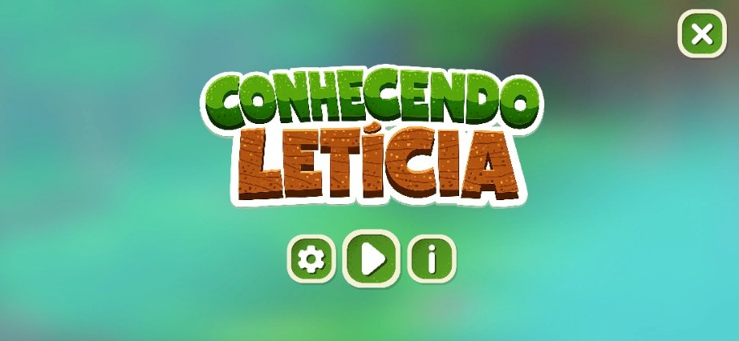

### Portfolio Gamificado Conhecendo Letícia

## 🎮 Sobre o Projeto

**Conhecendo Leticia** é uma experiência interativa 2D que transforma o tradicional portfólio web em um jogo de plataforma pixel art. Nascido da vontade de fazer algo genuinamente diferente, porque, afinal, ter um portfólio na web hoje em dia já não é mais diferencial este projeto convida o visitante a *jogar* para me conhecer.

> 💡 *A ideia é simples: ao invés de você rolar uma página web, você explora um mundo. Ao invés de clicar em seções, você desbloqueia casas. Ao invés de ler um currículo, você vive uma experiência.*

---

### 🕹️ Como Funciona
🗺️  MUNDO DO JOGO  
│
├── 🍄 Inimigos Cogumelos  →  Derrote-os para ganhar pontos  
│
├── 🪙 Moedas             →  Colete para acumular recursos  
│
├── 🏠 Casinhas           →  Desbloqueie com as moedas coletadas  
│    │
│    └── 🖼️  Canvas Interativo  →  Conheça os assuntos do portfólio  
│         ├── 👩 Sobre Mim  
│         ├── 💻 Tecnologias  
│         ├── 🎓 Formações  
│         └── 🚀 Projetos  

Cada **casinha** representa uma seção do portfólio. Ao desbloqueá-la, o jogador é transportado para um novo cenário e pode interagir com um **canvas dinâmico** contendo textos e informações sobre aquele tema.

---

### 🛠️ Tecnologias Utilizadas

#### 🎮 Unity (Motor de Jogo 2D)
Engine principal utilizada para desenvolver toda a lógica do jogo, controle do personagem, física, gerenciamento de cenas e sistema de HUD. A Unity oferece um ambiente robusto para desenvolvimento 2D com suporte completo a tilemaps, animações e sistemas de colisão.

#### 💻 C# (Linguagem de Programação)
Toda a lógica do jogo foi escrita em C#, a linguagem nativa da Unity. Desde o controle de movimento do personagem até o sistema de moedas, desbloqueio de casas e transição entre cenas — tudo é orquestrado via scripts em C# orientados a objeto.

#### 🎨 Aseprite (Pixel Art & Animação)
Ferramenta especializada em pixel art utilizada para criação e edição de todos os assets visuais do jogo: personagens, inimigos cogumelo, tiles de cenário, elementos de UI e animações frame a frame. O Aseprite permite exportar spritesheets prontos para integração com a Unity.

#### 🗂️ Git & GitHub (Versionamento & Publicação)
O projeto utiliza Git para controle de versão local e GitHub como repositório remoto, garantindo histórico completo de desenvolvimento, organização por branches e publicação do projeto. O GitHub Pages ou Unity WebGL é utilizado para disponibilizar o jogo online.

#### 🔊 Sound Design (Áudio & Imersão)
A sonorização foi pensada como parte essencial da experiência. Conceitos de **sound design** foram aplicados para criar trilhas de fundo imersivas, efeitos sonoros para ações do jogador (pulo, coleta de moeda, derrota de inimigo) e sons de ambiente para cada cenário. O áudio transforma a navegação pelo portfólio em algo memorável.

#### 🗺️ Tilemap (Construção de Cenários)
O sistema de **Tilemap** da Unity foi utilizado para construir todos os cenários do jogo de forma modular e eficiente. Tiles são organizados em paletas e pintados diretamente no editor, permitindo criar plataformas, chão, paredes e decorações com praticidade, além de facilitar a manutenção e expansão dos cenários.

### 🚀 Como Jogar

1. **Mova** o personagem pelo cenário
2. **Derrote** os cogumelos inimigos para coletar moedas
3. **Acumule moedas** suficientes para desbloquear uma casinha
4. **Entre na casinha** e seja transportado(a) para um novo cenário
5. **Interaja com o canvas** para conhecer mais sobre a Leticia
6. **Explore tudo** — cada casinha esconde uma parte da história!

---

### 💡 Motivação

Portfólios web viraram commodity. Qualquer pessoa com acesso a um template consegue montar um site bonito. A questão é: **como se destacar de verdade?**

A resposta foi transformar o próprio portfólio em uma obra — um jogo que convida o recrutador, cliente ou colega a não apenas *ver* as informações, mas a *conquistá-las*. Cada moeda coletada, cada casinha desbloqueada carrega uma intenção: fazer com que quem joga queira chegar até o fim.

---

### 👩‍💻 Autora

Feito com 💜 por **Leticia** — desenvolvedora que prefere construir mundos a preencher formulários.

---
---

## 🇺🇸 English

### 🎮 About the Project

**Conhecendo Leticia** (*"Getting to Know Leticia"*) is an interactive 2D experience that transforms the traditional web portfolio into a pixel art platform game. Born out of the desire to do something genuinely different — because, let's be honest, having a website portfolio is no longer a standout in today's market — this project invites visitors to *play* their way through getting to know me.

> 💡 *The concept is simple: instead of scrolling a webpage, you explore a world. Instead of clicking sections, you unlock houses. Instead of reading a resume, you live an experience.*

---

### 🕹️ How It Works
🗺️  GAME WORLD  
│
├── 🍄 Mushroom Enemies   →  Defeat them to earn points  
│
├── 🪙 Coins              →  Collect to accumulate resources  
│
├── 🏠 Little Houses      →  Unlock them with collected coins  
│    │
│    └── 🖼️  Interactive Canvas  →  Discover portfolio content  
│         ├── 👩 About Me  
│         ├── 💻 Technologies  
│         ├── 🎓 Education  
│         └── 🚀 Projects  

Each **little house** represents a section of the portfolio. Once unlocked, the player is taken to a new scene where they can interact with a **dynamic canvas** displaying texts and information on that topic.

---

### 🛠️ Technologies Used

#### 🎮 Unity (2D Game Engine)
The main engine used to develop the full game logic, character control, physics, scene management, and HUD system. Unity provides a robust environment for 2D development with full support for tilemaps, animations, and collision systems.

#### 💻 C# (Programming Language)
All game logic was written in C#, Unity's native language. From character movement to the coin system, house unlocking, and scene transitions — everything is orchestrated through object-oriented C# scripts.

#### 🎨 Aseprite (Pixel Art & Animation)
A specialized pixel art tool used to create and edit all visual assets in the game: characters, mushroom enemies, scenario tiles, UI elements, and frame-by-frame animations. Aseprite allows exporting spritesheets ready for Unity integration.

#### 🗂️ Git & GitHub (Version Control & Publishing)
The project uses Git for local version control and GitHub as the remote repository, ensuring a complete development history, branch organization, and project publishing. GitHub Pages or Unity WebGL is used to make the game available online.

#### 🔊 Sound Design (Audio & Immersion)
The audio was designed as an essential part of the experience. **Sound design** concepts were applied to create immersive background tracks, sound effects for player actions (jump, coin collection, enemy defeat), and ambient sounds for each scenario. The audio transforms navigating the portfolio into something truly memorable.

#### 🗺️ Tilemap (Scenario Construction)
Unity's **Tilemap** system was used to build all game scenarios in a modular and efficient way. Tiles are organized in palettes and painted directly in the editor, making it easy to create platforms, floors, walls, and decorations — while simplifying maintenance and expansion of levels.

---

### 🚀 How to Play

1. **Move** the character through the scenario
2. **Defeat** mushroom enemies to collect coins
3. **Accumulate** enough coins to unlock a house
4. **Enter the house** and be transported to a new scene
5. **Interact with the canvas** to learn more about Leticia
6. **Explore everything** — each house hides a piece of the story!

---

### 💡 Motivation

Web portfolios have become a commodity. Anyone with access to a template can put together a pretty site. The real question is: **how do you truly stand out?**

The answer was to turn the portfolio itself into a piece of work — a game that invites recruiters, clients, or colleagues not just to *see* the information, but to *earn* it. Every coin collected, every house unlocked carries an intention: to make whoever is playing want to reach the end.

---

### 👩‍💻 Author

Made with 💜 by **Leticia** — a developer who'd rather build worlds than fill out forms.
